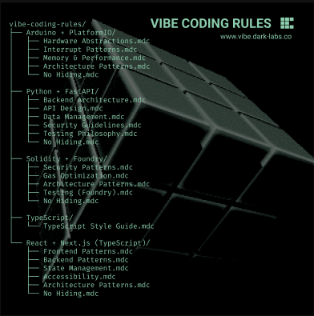

# Vibe Coding Rules



A comprehensive collection of Cursor AI coding rules and guidelines for multiple technology stacks. These rules help maintain consistency, code quality, security, and best practices across different types of projects when working with AI assistants in Cursor.

## What are Cursor Rules?

Cursor rules are markdown files (`.mdc` format) that provide context and guidelines to AI coding assistants. They help ensure that AI-generated code follows your project's specific patterns, conventions, architectural decisions, and best practices for each technology stack.

## Supported Technology Stacks

This repository contains coding rules for five major technology stacks:

### 🔌 [Arduino + PlatformIO](./Arduino%20+%20PlatformIO/)
**Embedded Systems & Microcontroller Development**

- **Framework:** Arduino Framework with PlatformIO
- **Language:** C++ (Arduino variant)
- **Focus:** Hardware abstraction, memory management, interrupt handling, real-time constraints
- **Key Guidelines:** Static allocation, minimal logging, hardware safety, power management

[📖 View Arduino + PlatformIO Rules →](./Arduino%20+%20PlatformIO/README.md)

### 🐍 [Python + FastAPI](./Python%20+%20FastAPI/)
**Backend API Development**

- **Framework:** FastAPI (Async REST API Framework)
- **Language:** Python 3.11+
- **Focus:** API design, async patterns, database management, security, testing
- **Key Guidelines:** Type hints, async/await, Pydantic validation, comprehensive testing

[📖 View Python + FastAPI Rules →](./Python%20+%20FastAPI/README.md)

### ⛓️ [Solidity + Foundry](./solidity%20+%20foundry/)
**Smart Contract Development**

- **Language:** Solidity 0.8.20+
- **Framework:** Foundry (Forge, Cast, Anvil, Chisel)
- **Focus:** Security, gas optimization, testing, upgradeability patterns
- **Key Guidelines:** Security-first approach, custom errors, comprehensive testing, NatSpec documentation

[📖 View Solidity + Foundry Rules →](./solidity%20+%20foundry/README.md)

### 📘 [TypeScript](./Typescript/)
**General TypeScript Development**

- **Language:** TypeScript
- **Focus:** Type safety, code quality, maintainability, best practices
- **Key Guidelines:** Never use `any`, descriptive naming, explicit return types, type guards, discriminated unions
- **Use Case:** Foundation for any TypeScript project, can be combined with framework-specific rules

[📖 View TypeScript Rules →](./Typescript/README.md)

### ⚛️ [TypeScript-React + Nextjs](./Typescript-React%20+%20Nextjs/)
**Full-Stack Web Development**

- **Framework:** Next.js (Pages Router)
- **Language:** TypeScript
- **UI Library:** Chakra UI
- **Focus:** React patterns, state management, accessibility, performance optimization
- **Key Guidelines:** TypeScript strict mode, Zustand for state, accessibility compliance, service layer testing

[📖 View TypeScript-React + Nextjs Rules →](./Typescript-React%20+%20Nextjs/README.md)

## Repository Structure

```
vibe-coding-rules/
├── README.md (this file)
├── Arduino + PlatformIO/
│   ├── README.md
│   ├── core-framework-&-language.mdc
│   ├── hardware-abstraction-patterns.mdc
│   ├── interrupt-handling-patterns.mdc
│   ├── memory-management-patterns.mdc
│   ├── error-handling-patterns.mdc
│   ├── performance-guidelines.mdc
│   ├── code-style-guidelines.mdc
│   ├── commenting-guidelines.mdc
│   ├── logging-guidelines.mdc
│   ├── key-architecture-patterns.mdc
│   ├── git-workflow.mdc
│   ├── code-review.mdc
│   ├── conflict-resolution.mdc
│   └── no-hiding.mdc
├── Python + FastAPI/
│   ├── README.md
│   ├── core-framework-&-language.mdc
│   ├── backend-architecture.mdc
│   ├── api-design-guidelines.mdc
│   ├── data-management-patterns.mdc
│   ├── error-handling-patterns.mdc
│   ├── performance-guidelines.mdc
│   ├── code-style-guidelines.mdc
│   ├── commenting-guidelines.mdc
│   ├── logging-guidelines.mdc
│   ├── key-architecture-patterns.mdc
│   ├── security-guidelines.mdc
│   ├── testing.mdc
│   ├── configuration-management.mdc
│   ├── dependency-management.mdc
│   ├── git-workflow.mdc
│   ├── code-review.mdc
│   ├── conflict-resolution.mdc
│   └── no-hiding.mdc
├── solidity + foundry/
│   ├── README.md
│   ├── core-framework-&-language.mdc
│   ├── security-guidelines.mdc
│   ├── code-style-guidelines.mdc
│   ├── commenting-guidelines.mdc
│   ├── logging-guidelines.mdc
│   ├── key-architecture-patterns.mdc
│   ├── error-handling-patterns.mdc
│   ├── performance-guidelines.mdc
│   ├── testing.mdc
│   ├── dependency-management.mdc
│   ├── git-workflow.mdc
│   ├── code-review.mdc
│   ├── conflict-resolution.mdc
│   └── no-hiding.mdc
├── Typescript/
    ├── README.md
    └── typescript-code-style-guide.mdc
└── Typescript-React + Nextjs/
    ├── README.md
    ├── core-framework-&-language.mdc
    ├── frontend.mdc
    ├── backend.mdc
    ├── key-architecture-patterns.mdc
    ├── state-management-patterns.mdc
    ├── styling-guidelines.mdc
    ├── error-handling-patterns.mdc
    ├── performance-guidelines.mdc
    ├── commenting-guidelines.mdc
    ├── logging-guidelines.mdc
    ├── accessibility-guidelines.mdc
    ├── testing.mdc
    ├── git-workflow.mdc
    ├── code-review.mdc
    ├── conflict-resolution.mdc
    └── no-hiding.mdc
```

## 🌐 GitHub Pages Frontend

**Browse the guidelines interactively:** [View on GitHub Pages](https://[your-username].github.io/vibe-coding-rules/)

A professional web interface is available to browse all coding rules and guidelines. The frontend provides:
- Interactive stack overview with statistics
- Full guide browser with search capabilities
- Markdown rendering for easy reading
- Responsive design for all devices

See [docs/README.md](./docs/README.md) for setup and development instructions.

## How to Use These Rules

### In Cursor IDE

1. **Automatic Application:** Files with `alwaysApply: true` in their frontmatter are automatically applied to all AI interactions.

2. **Context-Aware Application:** Files with `globs` patterns are applied when working with matching file types or directories.

3. **Manual Reference:** You can reference specific rules in your prompts:
   ```
   @code-style-guidelines.mdc Please format this code according to our style guide
   @security-guidelines.mdc Review this function for security issues
   ```

### Setting Up Rules for Your Project

1. **Choose Your Stack:** Navigate to the appropriate technology stack folder
2. **Copy Rules:** Copy the `.mdc` files relevant to your project
3. **Configure:** Set up `alwaysApply` flags and `globs` patterns as needed
4. **Customize:** Adapt rules to your specific project requirements

## Common Principles Across All Stacks

While each technology stack has its own specific guidelines, there are several universal principles that apply across all stacks:

### ✅ No Hiding (`no-hiding.mdc`)
**Critical Rule:** Never hide compiler warnings, linter errors, type checker warnings, or security issues. All must be resolved.

### 📝 Logging Guidelines
**⚠️ IMPORTANT:** Only add logs when explicitly requested. By default, do NOT add logs unless asked.

### 💬 Commenting Guidelines
- Focus on explaining the **"why"** and **"intent"**, not just the **"what"**
- Use appropriate documentation formats (Doxygen, JSDoc, NatSpec, Google-style docstrings)
- Document public APIs, complex logic, and non-obvious decisions

### 🎯 Code Style
- **NEVER abbreviate variables** - Always use full, descriptive names
- Consistent naming conventions (camelCase, snake_case, PascalCase as appropriate)
- Proper indentation and formatting
- Follow language-specific style guides

### 🧪 Testing
- Write comprehensive tests
- Aim for high coverage on critical paths
- Test edge cases and error conditions
- Use appropriate testing frameworks for each stack

### 🔀 Git Workflow
- Use Conventional Commits format
- Write clear, descriptive commit messages
- Make atomic commits
- Never commit secrets or sensitive data

### 👀 Code Review
- Review for functionality, quality, security, and adherence to guidelines
- Provide constructive feedback
- Verify test coverage

### ⚖️ Conflict Resolution
- When rules conflict, refer to `conflict-resolution.mdc` in each stack
- Hardware/security constraints typically take precedence
- Document exceptions when necessary

## Quick Reference by Stack

### 🔌 Arduino + PlatformIO
- ✅ Use static memory allocation whenever possible
- ✅ **NEVER use String class** - Use char arrays with bounds checking
- ✅ Keep ISRs minimal - just set flags and return
- ✅ Document all hardware assumptions and connections
- ✅ Use PROGMEM for constant strings

### 🐍 Python + FastAPI
- ✅ Use type hints for all function signatures
- ✅ Write Google-style docstrings for public APIs
- ✅ Use async/await for I/O operations
- ✅ Validate all inputs with Pydantic
- ✅ Aim for 100% test coverage on service/repository layers

### ⛓️ Solidity + Foundry
- ✅ Follow checks-effects-interactions pattern
- ✅ Use custom errors (gas efficient)
- ✅ Emit events for all important state changes
- ✅ Write comprehensive Foundry tests
- ✅ Security-first approach - never compromise security for gas

### 📘 TypeScript
- ✅ Never use `any` - use `unknown` and narrow it
- ✅ Always use descriptive, non-abbreviated variable names
- ✅ Provide explicit return types for exported functions
- ✅ Use type guards for runtime type checking
- ✅ Leverage discriminated unions for complex state

### ⚛️ TypeScript-React + Nextjs
- ✅ Use TypeScript strict mode
- ✅ Write JSDoc comments for public APIs
- ✅ Use Zustand for global state management
- ✅ Ensure WCAG AA accessibility compliance
- ✅ Test service layer with 100% coverage

## Contributing

When updating or adding rules:

1. **Keep Guidelines Clear:** Write actionable, specific guidelines
2. **Include Examples:** Provide code examples where helpful
3. **Update READMEs:** Update both the stack-specific README and this root README when adding new rule files
4. **Maintain Consistency:** Ensure consistency across related rule files
5. **Test Guidelines:** Verify guidelines work well with AI assistants

## Notes

- Rules are tailored for each specific technology stack and framework
- Rules marked with `alwaysApply: true` are enforced automatically in Cursor
- The logging guidelines emphasize minimal logging by default - only log when explicitly requested
- The "no-hiding" rule is critical across all stacks - all errors and warnings must be resolved
- When rules conflict, refer to the `conflict-resolution.mdc` file in each stack directory
- Security and hardware constraints typically take precedence over general programming practices

## License

[Add your license information here]

## Support

For questions or issues with these coding rules, please refer to the individual stack README files or create an issue in the repository.

